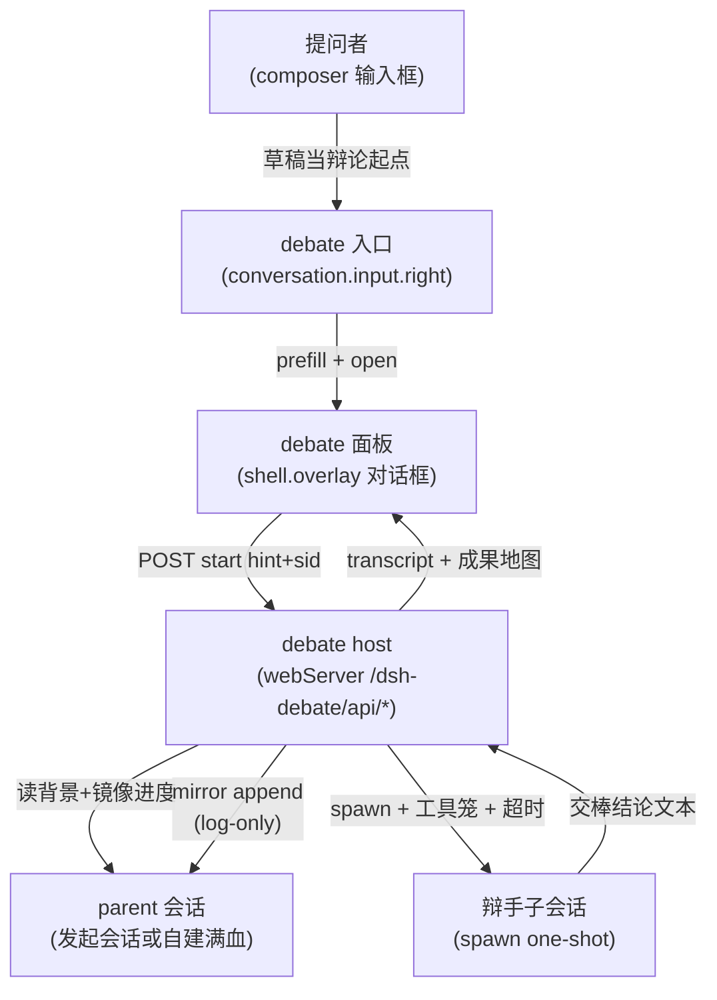
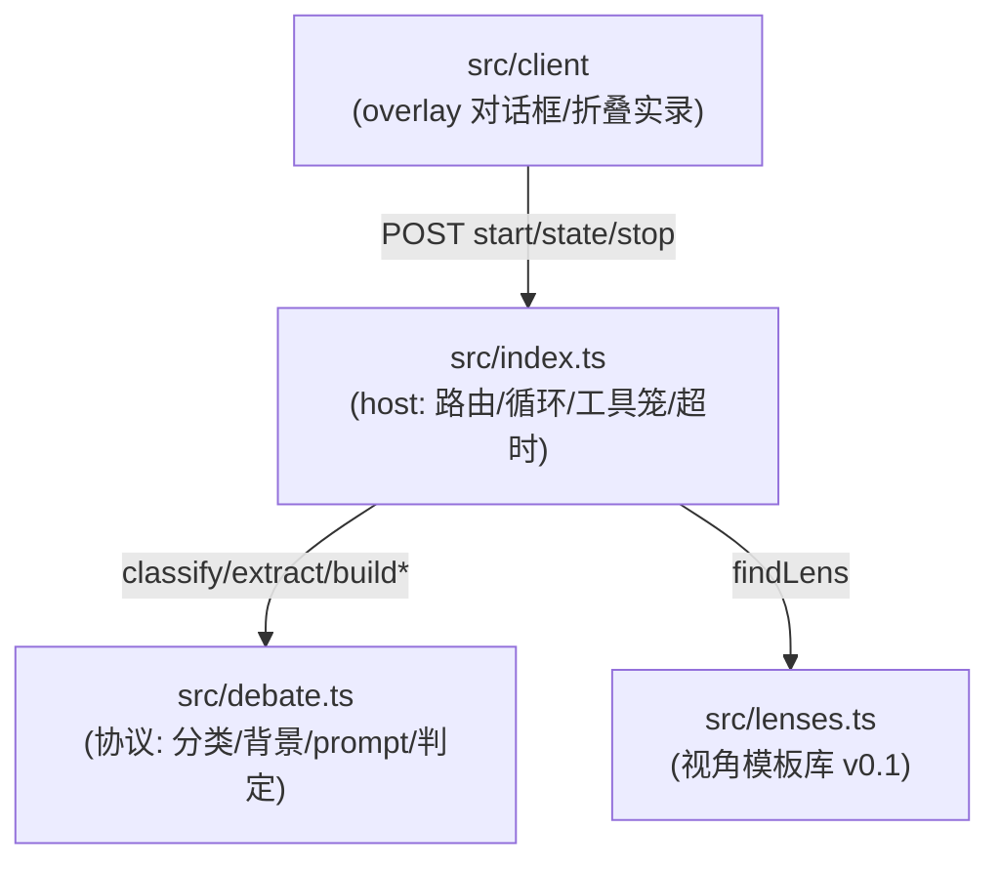
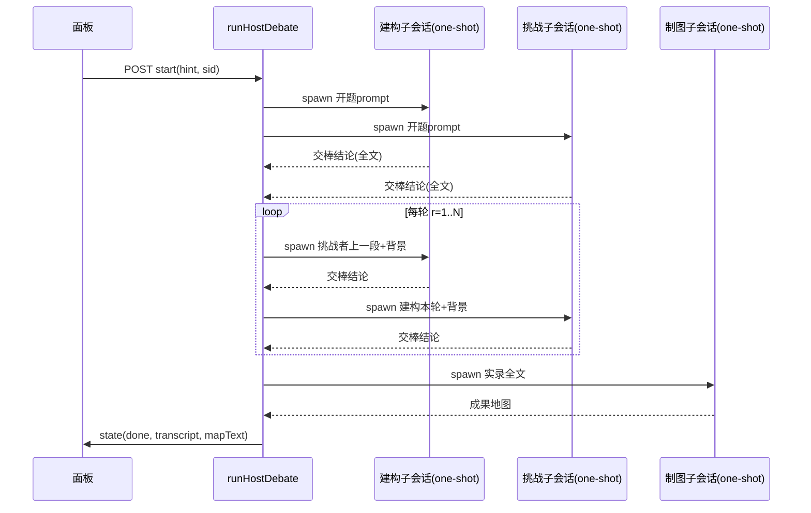

# dsh-debate Architecture Description

> Provenance: `arch` retrofit on a brownfield DSH native plugin (2026-09-30).
> Zero-invention: every statement traces to `CONTEXT.md`, `docs/adr/0001~0012`, or the code in `src/`.

## 1. Identification and Scope

- **System Name**: dsh-debate (doubleelec native DSH plugin `elec-debate`).
- **Purpose**: 为开放性论证题跑建构 / 挑战 / 制图三角色，产出一套固定五件套成果地图，而非单一结论句。
- **Scope**: `src/` 下的 host 半区（webServer 路由 + debate 工具 + 辩论循环）与浏览器 bundle（overlay 对话框 + 输入框入口）。`test/`（vitest）、`scripts/`、`tests/governance` 在治理外；部署与发包在圈外（见 spec Out of Scope）。

## 2. Stakeholders and Concerns

- **提问者（最终用户）**: 只想点一下就开辩，不填表单；要看到辩论过程可读、可审计；最终拿地图自己做判断。
  - **Concerns**: 入口无缝（ADR-0008），过程可读，产物忠实（ADR-0001/0002）。
- **插件维护者**: 改判定逻辑不回归，host 注册失败可观测，重启不丢可诊断信息。
  - **Concerns**: 协议纯函数可单测（spec 缝一），路由契约可查（`/api/debug*`），架构漂移被门拦住。
- **DSH 部署**: 插件不得扩权（`restrict` 单向收窄），不得改 preset 文件，不得发包到 prod。
  - **Concerns**: 工具笼只收窄（ADR-0012），`standard` preset 部署所有。

## 3. Quality Attribute Scenarios (QAS)

- **QAS-1 可读性**: 5 轮辩论（约 13 次子调用，每方 4000+ 字）落进 720px 对话框时，提问者 30 秒内能说出“谁让了什么、新增了什么”。驱动分段折叠（摘要默认展开、论证折叠）。
- **QAS-2 可审计性**: 任何“已一致/分歧”结论都能回跳到 `[R轮 #seq 角色]` 原文；中断原因（超时/人停/模型拒活）实报，不吞成 `aborted`。
- **QAS-3 不丢不卡**: 子 agent 调 `ask_user_question` 或大海捞针时必失败、不无限卡 `round=-1`；开题一边挂了另一边的内容保留（`open-failed: builder=… challenger=…`）。**常驻辩手用进度感知超时**：一次性子 agent 走 6 分钟单步超时（无进度可见）；常驻轮次按事件增长判活——4 分钟无新事件判 `stalled`，20 分钟硬顶判 `timeout`（有进度也砍）。实测教训：给常驻轮次套 6 分钟硬顶会误杀"读了两个文件、跑多轮工具"的正常开题。
- **QAS-4 满血只读**: 辩手能读文件/检索/联网查证（31 工具继承链），但写不了文件、执行不了 shell、套不了娃（17 项 deny 笼）。

## 4. Viewpoints and Views

### 4.1 Context View

- **Purpose**: 插件在 DSH 里只占三个槽位 + 一组 HTTP 路由，不碰会话主循环。
- **Model/Diagram**:

- **Elements**: 外部只有三样：发起会话（读背景/写镜像）、子 agent 设施（`ctx.subagents` spawn）、浏览器（轮询 state）。

### 4.2 Logical Decomposition View

- **Purpose**: 单治理模块 `src`，内部按文件分工；client 是嵌套治理模块。
- **Model/Diagram**:

- **Elements**:
  - `src/index.ts` 宿主侧分两层：
    - **常驻交棒（默认路径）**：`createResidentPair`（`agents.create` 建双常驻会话 + preset 继承 + `subagent:delegation` 上下文 + 17 项 deny 笼）、`stepOpenResident/stepRoundResident`（开题互盲、交锋串行）、`driveResidentTurn`（`followup` 投交棒结论 → 进度感知等到 `whenIdle` → 读自有事件后缀 → 校验终止原因 → 取交棒结论；provider `error` 有界重投）、`readResidentEvents/extractHandoffConclusion/epochStopReason/epochStopDetail/turnVerdict`。
    - **一次性回退**：`askSubagent`（spawn + 工具笼 + 6min 单步超时 + 实报）与 `stepOpen/stepRound/stepSynthesize`；`agents` 缺失或建对失败时整场回退，`mode/residentError` 记录原因。
    - **共用**：`runHostDebate`（后台直驱 open→round×N→synthesize + 停机三条件）、`createFullParent`（webhook 样板挂 preset）、`mirror`（`user/message` + `surfaceOp:'append'`）。
  - `src/debate.ts`: `classifyQuestion`（关键词启发式）、`extractSessionContext`（4000 字截断）、`buildBuilderPrompt/buildBuilderRoundPrompt/buildChallengerPrompt/buildSynthesizerPrompt`（三段式：结论摘要/详细论证/本轮变化，v4 起带 `focus` 焦点块与篇幅预算；制图要求先出「决策摘要」段）、`parseAgree/parseAnswer/detectNewInfo/isConverged`（停机协议）、`parsePendingItems/normalizePending/pendingStalled/formatPendingFocus`（v4 未决清单焦点账本）、`changesOf/sectionText`（分段取值）、`extractDecisionSummary/stripDecisionSummary/buildFallbackSummary`（v4 收尾陈述）、`isSaturated/normalizeAnswer/containsBannedPhrase`、`STOP_PROTOCOL_VERSION`（B5 解析版本位，v4）、`auditQuotes/QUOTE_FRAG_LEN/QUOTE_HIT_ALERT`（B6 片段级引用审计）、`ROUND_DETAIL_MAX_CHARS/PENDING_MAX_ITEMS`（v4 预算）。
  - `src/lenses.ts`: 四类题型种子模板（selection/review/tradeoff/causal）。
  - `src/version.ts`: 版本真值——`BUILD_VERSION`（构建期内联，host/client 各一份）+ `assessVersions`（内联版本 / 磁盘 manifest / bundle mtime 与进程启动时刻三方对账）+ `isClientStale`。host 侧 `/dsh-debate/api/version` 出事实，面板徽标显示**正在跑的版本**并在磁盘更新时要求重启宿主（ADR-0018）。
  - `src/client`: 停机审计块 + 镜像状态行（state 早有字段，S3 才接上）；`sections.ts` 纯分段函数（`splitSections` 从 index.tsx 抽出，可单测不拖 React/CSS）。实况只在辩论框内看（2s 轮询 `TurnCard/StreamCard`），独立实况页已删除（生产环境反向代理下基址推导打偏，只会“连接中…”）。
  - `src/client`: `DebateDialog`（2s 轮询 + 分段折叠 `TurnCard`）、`InputEntry`（草稿门控）、`useSessions.current` 透传（修 `input.right` 空 props 的根子）。

### 4.3 Module Documentation Map

| Module | Docs bucket | Reason | Module doc paths |
| ------ | ----------- | ------ | ---------------- |
| `src` | top-level only | 单插件单模块，无独立发包/测试节拍 | - |
| `src/client` | top-level only | 随 host 同构建同发布（tsdown 一次出双 bundle） | - |

- **Coverage note**: `arch` TOML 覆盖是全量的；`test/`（vitest 单测）、`scripts/`、`tests/` 不在治理树内，见 `architecture.toml` 注释。

### 4.4 Runtime/Concurrency View

- **Purpose**: 现行一次性起辩（`one_shot_delegation`）的时序；常驻辩手是下一跳（见 §5 ADR-0013 计划）。
- **Model/Diagram**:

- **Elements**: 并发只在开题（`Promise.allSettled` 独立结算）；交锋串行（保证看到最新）；制图只读实录。超时/中止走 `AbortController` 链（外层 stop → 内层 timeout）。

### 4.5 Deployment/Physical View

- **Purpose**: 单包双 bundle，dev 联调用 3090。
- **Elements**: `lib/index.js`（host）+ `lib/client.js`（bundle，经 `dsh.client` 声明）；`cordis.patch.yml` 插入组合；`dsh.plugin.json` 声明 `debate_*` 四工具与三槽位。dev 用 `dsh --profile dev --port 3090 --no-open`，client 硬刷（Ctrl+Shift+R）。

## 5. Architecture Decisions

- [ADR-0001](adr/0001-map-not-verdict.md): 产物是地图而非结论句。
- [ADR-0002](adr/0002-three-roles.md): 建构/挑战/制图三角色分离，裁判默认关。
- [ADR-0003](adr/0003-hybrid-lens.md): 视角模板保下限、动态拔上限、人审保方向。
- [ADR-0004](adr/0004-saturation-stop.md): 停在覆盖饱和而非共识收敛（排他性表述已被 ADR-0014 修正）。
- [ADR-0005](adr/0005-claim-layering.md): 断言先分事实/推理/价值三层。
- [ADR-0006](adr/0006-synthesizer-reuse.md): 制图员复用辩手模型时新会话即算独立。
- [ADR-0007](adr/0007-context-pack.md): 背景包只进辩手不进制图员。
- [ADR-0008](adr/0008-auto-resolve.md): 入口只留三模型，问题与背景全自动。
- [ADR-0009](adr/0009-stepwise-tools.md): 分步工具将会话直播（已被 host 直驱继承）。
- [ADR-0010](adr/0010-tool-registration.md): 工具注册三硬伤与 `/api/debug` 可观测。
- [ADR-0011](adr/0011-host-driven.md): host 直驱，点开始就自动跑。
- [ADR-0012](adr/0012-full-parent.md): 自建 parent 挂默认 preset，子 agent 满血的优雅通道。
- [ADR-0013](adr/0013-resident-debater.md): 常驻辩手 + 交棒结论，替代一次性起辩。
- [ADR-0014](adr/0014-stop-conditions.md): 停机三条件（共识/饱和/跑满）+ 判定输入落盘，修正 ADR-0004 的排他表述。
- [ADR-0015](adr/0015-handoff-slimming.md): 交棒载荷瘦身——跨轮传摘要（-87%），同轮传全文。
- [ADR-0016](adr/0016-audit-protocol.md): 停机信号协议版本化（B5）+ 片段级引用审计（B6，下限估计）+ 面板/实况审计展示联调。
- [ADR-0017](adr/0017-focus-ledger-and-closing-statement.md): 协议 v4——未决清单焦点账本 + 新增判定只看「本轮变化」段 + 篇幅预算 + 对话区镜像摘要 + 收尾陈述（决策摘要/兜底）。
- [ADR-0018](adr/0018-version-truth.md): 版本真值——构建期内联 + 三方对账；徽标显示正在跑的版本，取不到时显示 `v?` 而非冒充新版本。

## 6. Constraints and Risks

- **Technical Constraints**: `tools.restrict` 单向收窄——插件能禁不能加；`subagent` 是 preset 层 scope-local 名，deny 列了就抛 unknown（实测）；`conversation.input.right` 空 props——sid 必须走 overlay 的 `useSessions.current`。
- **Business Constraints**: 不改部署的 `standard` preset 文件；不发布 prod（3080）与 npm。
- **Identified Risks**:
  - 常驻辩手 context 膨胀（第 5 轮 prompt 爆掉）→ 跨轮交棒瘦身（`slimHandoff`，实测 -87%）+ `builderRelayChars` 可观测（ADR-0015）；同轮仍传全文保引用能力。
  - 饱和启发式召回偏低（关键词 + 相似度）→ 已加否定关（"没有新增缺口"不再误判为新增）与"显式无新增声明"快判。**10-01 实测发现更严重的是假阳性**：`detectNewInfo` 在整篇 6000~8000 字里找信号词，10/10 轮全判"有新料"，饱和停机形同死代码。修法见 ADR-0017：只看「本轮变化」段 + 未决清单焦点停滞（结构化判据，不再靠满篇找词）。
  - 模型不守约输出 `待决清单=` 行时焦点账本失效 → 三态解析（`null` 未提供 / `[]` 清空 / 有内容）保证退化方向是"多辩几轮"而非"误停"；`rounds[].pendingItems` 落盘可事后核对守约率。
  - `startContinuable` 要 `sessionPersistence` + `sessionQuery`，插件 host 未必挂载 → 首选 `agents.create` + `followup` + `whenIdle` 直驱（见 ADR-0013），不依赖 continuable 管理器。
  - provider 会抖：实测 muse 路由抛 `Internal error: name '_muse_session_id' is not defined`（偶发），一次抖动就废掉整场 → 同会话内对 `error` 有界重投 3 次；重投判据 `isRetriableTurnError`（超时/卡死/空输出/拒绝不重投）。
  - 固定单步超时会误杀正常长轮次（实测 6 分钟砍掉"读两个文件 + 多轮工具"的开题）→ 常驻轮次改进度感知（4 分钟无事件判 stalled / 20 分钟硬顶），一次性路径仍用固定 6 分钟（无进度可见）。
  - 内存会话表重启即清（`unknown-id`）→ 重启后面板局需重开；后续可持久化（out of scope）。

## 7. Test Architecture

- **Vocabulary**: unit test 管一个 ticket，integration test 管一个 spec，常驻辩手 effort 的 system test 跑“真 1 轮辩论端到端”（两个常驻辩手 + 制图，断言 transcript 结构与交棒链不断）。
- **Tools**: vitest（`test/debate.test.ts`，53 用例：协议纯函数 + 回合推进 + 面板分段，2026-09-30 本地 53/53）；pytest（`tests/governance` vendored 三件套 + `tests/src` 镜像）；`arch_engine.py check`（TOML/孤儿/幻影/漂移门）；沙箱内 vitest 起不来（spawn EPERM）时用 `.tmp/s{2,3}check_run.cjs` 真跑协议层 + 纯渲染逻辑（tsc 编译后 node 直跑，与 vitest 用例逐条对应）。
- **Directory layout**: `test/` → vitest；`tests/governance/` → 只读 vendored 门；`tests/src/` → 模块镜像（含 `test_invariants.py` 占位）；`docs/test_index.md` → 治理套件目录；`.tmp/` → 沙箱替代校验脚本与真跑 state（gitignored，可清）。
- **Layer-scope overrides**: 本 effort 单 spec 跨 host+client 双 bundle，其 integration gate 按 system-grade 跑（真起子 agent 读文件，见笼子验证局），已在 `docs/action-plan.md` Wave 1 注记，不静默。
